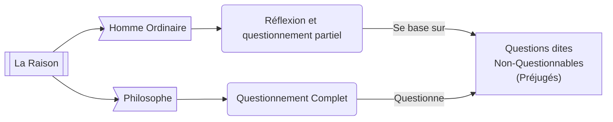

# 📖 Texte
- 👤 Auteur: **Ian Patocka**
- 📆 Publié en 1934

# ☃️ Introduction
*Es ce que l'homme ordinaire ne réfléchit pas du tout ?*

Le texte parle des distinctions entre les différents "modes" de raison. Il met en valeur la perte du raisonnement philosophique chez les êtres humains, du aux impératifs de la vie et le conditionnement de la société.

Il y a bien deux manières de vivre **mais pas deux types d'hommes**.

Il arrive cependant que certaines questions (tel que le *Il faut s'adapter*) entraîne **un éveil à la liberté**.
# 1️⃣ La vie ordinaire - le xxx accepté
Le premier paragraphe du texte incite sur la singularité du mode de pensé philosophique.

## 🌿 La Croyance Naturelle
> Synonymes : Opinion Originaire, Attitude Naturelle, Foix Perceptive

La **Croyance Naturelle** est une base que tout humain possède et acquis à la naissance. Elle inclut :
- L'existence de soi et du monde
- *Toute autre question (in)fondé ?*

La philosophie née de **l'étonnement face à l'existence de ces croyances**.

## 🧩 Le Conditionnement Culturel
> Synonymes : Aucuns

Contrairement au croyances naturelles, le conditionnement culturel est acquis durant l'existence d'un individu. Cela inclut :

### 📜 Les traditions
- L'opinion politique
- La religion, même até
- L'évolution technologie et temporelle

> L'époque et les créations techniques nous influence dans le sens où la communication (avec les resaux sociaux & internet) qui ont drastiquement modifiés nos relations sociales.

### 🪗 La Langue
La langue est un paradoxe : la ou elle paraît être un outil qui libéré la pensé, son existence permet aussi de la limiter. La langue est composé de trois objets :
- 1
- 2
- 3

### 🌥 Kosmtheoros
Le Kosm**o**theoros est qqchose 

# 2️⃣ Ébranlement et étonnement : la vie interrogé

*En cours d'écriture*

## ☄️ Les experiences négatives et l'éveil de la raison